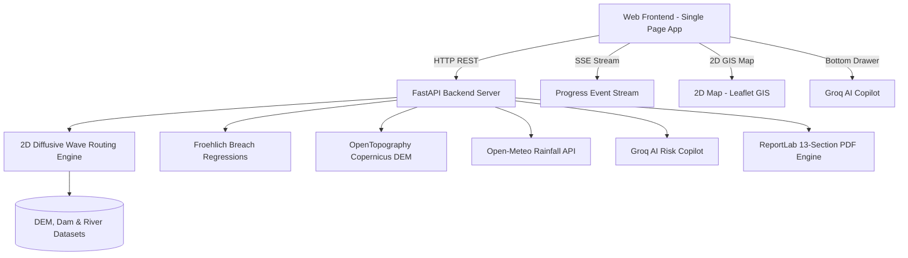

# Dam Break Inundation Modelling Using Hydrodynamic Modelling of any River

> **Smart India Hackathon (Problem Statement SIH26161)**  
> *Hydrodynamic Dam Breach Simulation, Diffusive-Wave Flood Wave Routing, Live Weather Integration, and AI Disaster Copilot.*

---

## Executive Summary

Dam failure events generate catastrophic, fast-moving flood waves capable of overwhelming downstream communities, critical infrastructure, and emergency response services within minutes. 

This platform delivers an enterprise-grade solution coupling empirical dam breach regressions (**Froehlich equations**) with a high-performance **2D diffusive-wave hydrodynamic flood routing solver**. It provides a high-resolution **interactive 2D GIS map simulation**, live Open-Meteo rainfall intensity streaming, multi-scenario comparative analysis, Groq AI disaster copilot guidance, and automated CWC/NDMA executive PDF report generation.

> **Note on 3D Visualization**: The current production release focuses on **Map-Based 2D Hydrodynamic Simulation** for maximum cross-device performance, deterministic hydraulic accuracy, and real-time response. The **3D Dam Digital Twin** subsystem is actively tracked and scheduled for an upcoming post-SIH update (see [`docs/3D_IMPLEMENTATION_ROADMAP.md`](file:///c:/Users/Lohith%20G/Downloads/SIH_WINNING_PROJECT/dam-break-inundation/docs/3D_IMPLEMENTATION_ROADMAP.md)).

---

## Key Features & Innovations

- **Hydrodynamic Simulation Engine**:
  - Empirical breach hydrograph calculation (Froehlich 1995/2008) for **piping**, **overtopping**, **structural**, and **earthquake** failure modes.
  - 2D diffusive-wave flood wave routing using adaptive time-stepping based on the Courant-Friedrichs-Lewy (CFL) stability criterion.
  - Topological smooth contour polygon extraction via `rasterio` and `shapely.ops.unary_union`.
- **National Dam Safety Database**:
  - Integrated catalog of **6,644 national dams** across India (National Dam Safety Authority / CWC data).
  - Pre-calibrated real-world dataset for **Mettur Dam (Stanley Reservoir)** on the Kaveri River.
- **Interactive 2D GIS Simulation Viewport**:
  - **Leaflet 2D GIS**: Interactive spatial map with multi-layer heatmaps (Flood Depth, Flow Velocity, Hazard Risk $D \times V$, Wave Arrival Time).
  - Clean flood wavefront polygons with dynamic styling, settlement vulnerability markers, and time-scrubbing playback.
- **Live Weather Integration**:
  - Real-time rainfall intensity updates ($\text{mm/hr}$) fetched via Open-Meteo API.
- **Multi-Scenario Comparison**:
  - Side-by-side comparative analysis of failure modes to evaluate deltas in peak flood depth, inundated area, and settlement arrival times.
- **Real-Time Progress Streaming (SSE)**:
  - Asynchronous Server-Sent Events streaming progress updates during complex DEM hydrodynamic routing.
- **Groq AI Disaster Copilot & PDF Export**:
  - Floating bottom-corner engineering copilot powered by Groq LPU inference.
  - Automated 13-section CWC/NDMA compliant executive PDF report generation with discharge hydrograph curves.
- **Upcoming 3D Dam Digital Twin**:
  - Three.js WebGL terrain mesh with dynamic PBR water shaders and GLB dam structures planned for future release.

---

## System Architecture



---

## Hydrodynamic Physics & Mathematics

### 1. Froehlich Breach Outflow ($Q_p$)

$$\text{Piping Failure: } Q_p = 0.607 \cdot V_{w}^{0.295} \cdot H_{w}^{1.24}$$

$$\text{Overtopping Failure: } Q_p = 0.705 \cdot V_{w}^{0.295} \cdot H_{w}^{1.24}$$

### 2. 2D Diffusive Wave Continuity & Momentum Equations

$$\frac{\partial h}{\partial t} + \frac{\partial (h u)}{\partial x} + \frac{\partial (h v)}{\partial y} = q_{in}$$

$$u = \frac{1}{n} h^{2/3} \sqrt{\left|\frac{\partial (z+h)}{\partial x}\right|} \cdot \text{sgn}\left(-\frac{\partial (z+h)}{\partial x}\right)$$

*For detailed derivations and CFL stability bounds, see [`docs/HYDRODYNAMICS.md`](file:///c:/Users/Lohith%20G/Downloads/SIH26161/dam-break-inundation/docs/HYDRODYNAMICS.md).*

---

## Repository Structure

```text
dam-break-inundation/
│
├── backend/
│   ├── app/
│   │   ├── main.py              # FastAPI core routes & static asset serving
│   │   ├── flood.py             # Simulation runner & smooth polygon generation
│   │   ├── routing.py           # 2D diffusive wave flood solver
│   │   ├── breach.py            # Froehlich empirical breach model
│   │   ├── failure_modes.py     # Piping, Overtopping, Structural, Earthquake
│   │   ├── report_engine.py     # CWC 13-section official PDF report generator
│   │   ├── compare.py           # Multi-scenario comparison endpoint
│   │   ├── weather.py           # Live Open-Meteo rainfall service
│   │   ├── progress.py          # SSE progress streaming router
│   │   ├── dem_fetcher.py       # Copernicus 30m DEM loader & cache
│   │   └── ai/                  # Groq AI copilot module & engineering prompts
│   ├── tests/                   # Pytest automated test suite (54 test cases)
│   └── requirements.txt         # Python backend dependencies
│
├── frontend/
│   ├── index.html               # Single-page application entrypoint
│   ├── app.js                   # Application state & Leaflet GIS controller
│   ├── ai_panel.js              # Floating bottom-corner Groq AI Copilot
│   ├── style.css                # Enterprise minimalist GIS dark theme
│   ├── vite.config.js           # Vite development and bundle configuration
│   └── viewer/                  # 3D Digital Twin engine (Post-SIH update)
│
├── datasets/
│   ├── dam/                     # 6,644 National Dams GeoJSON & Mettur CSV
│   ├── dem/                     # Mettur SRTM/COP30 DEM & cache tiles
│   ├── river/                   # Kaveri river reach vector
│   └── villages/                # Downstream settlement census points
│
└── docs/                        # Complete technical documentation
    ├── 3D_IMPLEMENTATION_ROADMAP.md # Post-SIH 3D Digital Twin Roadmap
    ├── ARCHITECTURE.md          # Subsystem design & data pipeline
    ├── HYDRODYNAMICS.md         # Equations & mathematical proofs
    ├── API_REFERENCE.md         # REST API & SSE specification
    └── DATASETS.md              # Geospatial dataset details
```

---

## Getting Started

### Prerequisites

- **Python**: 3.10+ installed
- **Node.js**: 18+ installed

### 1. Setup Backend

```bash
cd backend
python -m venv venv
# On Windows:
venv\Scripts\activate
# On Linux/macOS:
source venv/bin/activate

pip install -r requirements.txt
```

### 2. Launch the Application

```bash
# Terminal 1: Backend
cd backend
uvicorn app.main:app --host 0.0.0.0 --port 8000 --reload

# Terminal 2: Frontend
cd frontend
npm install
npm run dev
```

Open your browser and navigate to:
- **Application Web Interface**: `http://localhost:5173/` (or `http://localhost:8000/`)
- **Interactive API Docs (Swagger)**: `http://localhost:8000/docs`
- **Health Check**: `http://localhost:8000/health`

### 3. Run Automated Tests

```bash
cd backend
pytest tests/ -v
```

---

## Documentation Index

The platform includes a comprehensive, production-grade documentation suite:

1. [Developer Documentation](file:///c:/Users/Lohith%20G/Downloads/SIH_WINNING_PROJECT/dam-break-inundation/DEVELOPER_DOCUMENTATION.md) — Map-First Production Technical Reference
2. [3D Implementation Roadmap](file:///c:/Users/Lohith%20G/Downloads/SIH_WINNING_PROJECT/dam-break-inundation/docs/3D_IMPLEMENTATION_ROADMAP.md) — Post-SIH 3D Digital Twin & 3D Dam Upgrade Specification
3. [Architecture Specification](file:///c:/Users/Lohith%20G/Downloads/SIH_WINNING_PROJECT/dam-break-inundation/docs/ARCHITECTURE.md) — 2D Map Simulation Subsystem Design & Data Pipeline
4. [Hydrodynamics Guide](file:///c:/Users/Lohith%20G/Downloads/SIH_WINNING_PROJECT/dam-break-inundation/docs/HYDRODYNAMICS.md) — Empirical Breach Kinetics & 2D Diffusive Wave Proofs
5. [API Reference](file:///c:/Users/Lohith%20G/Downloads/SIH_WINNING_PROJECT/dam-break-inundation/docs/API_REFERENCE.md) — REST API Endpoints & SSE Streaming Contracts
6. [Folder Architecture](file:///c:/Users/Lohith%20G/Downloads/SIH_WINNING_PROJECT/dam-break-inundation/docs/FOLDER_ARCHITECTURE.md) — Repository Directory Structure & Module Responsibilities
7. [Rendering Pipeline](file:///c:/Users/Lohith%20G/Downloads/SIH_WINNING_PROJECT/dam-break-inundation/docs/RENDERING_PIPELINE.md) — Digital Twin WebGL Ingestion (Roadmap)
8. [Camera System](file:///c:/Users/Lohith%20G/Downloads/SIH_WINNING_PROJECT/dam-break-inundation/docs/CAMERA_SYSTEM.md) — Polar Clamping & Bounds Presets (Roadmap)
9. [Asset Pipeline](file:///c:/Users/Lohith%20G/Downloads/SIH_WINNING_PROJECT/dam-break-inundation/docs/ASSET_PIPELINE.md) — Digital-Twin GLB Discovery (Roadmap)
10. [Performance Guide](file:///c:/Users/Lohith%20G/Downloads/SIH_WINNING_PROJECT/dam-break-inundation/docs/PERFORMANCE_GUIDE.md) — 60 FPS Optimization & Profiling Guidelines

---

## License & Attribution

Developed for Smart India Hackathon. 

Geospatial data sourced from National Dam Safety Authority (NDSA), Central Water Commission (CWC), Copernicus Open Access Hub, OpenTopography, HydroSHEDS, and Open-Meteo.


---

## Author 


LOHITH G


