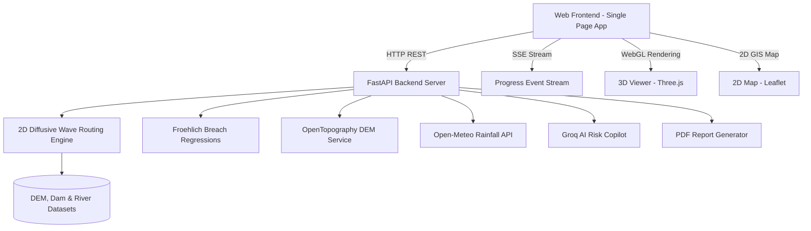

# Dam Break Inundation Modelling Using Hydrodynamic Modelling of any River

> **Smart India Hackathon (Problem Statement SIH26161)**  
> *Hydrodynamic Dam Breach Simulation, 2D Diffusive-Wave Flood Wave Routing, WebGL 3D Visualization, Live Weather Integration, and AI Disaster Copilot.*

---

## Executive Summary

Dam failure events generate catastrophic, fast-moving flood waves capable of overwhelming downstream communities, critical infrastructure, and emergency response services within minutes. 

This platform delivers an enterprise-grade solution coupling empirical dam breach regressions (**Froehlich equations**) with a high-performance **2D diffusive-wave hydrodynamic flood routing solver**. It provides synchronized 2D GIS map layers and **interactive WebGL 3D terrain flood propagation**, live Open-Meteo rainfall intensity streaming, multi-scenario comparative analysis, Groq AI disaster copilot guidance, and automated PDF executive report generation.

---

## Key Features & Innovations

- **Hydrodynamic Simulation Engine**:
  - Empirical breach hydrograph calculation (Froehlich 1995/2008) for **piping**, **overtopping**, **structural**, and **earthquake** failure modes.
  - 2D diffusive-wave flood wave routing using adaptive time-stepping based on the Courant-Friedrichs-Lewy (CFL) stability criterion.
- **National Dam Safety Database**:
  - Integrated catalog of **6,644 national dams** across India (National Dam Safety Authority / CWC data).
  - Pre-calibrated real-world dataset for **Mettur Dam (Stanley Reservoir)** on the Kaveri River.
- **Synchronized 2D & WebGL 3D Visualization**:
  - **Leaflet 2D GIS**: Interactive spatial map with flood depth contours, dam placement, and settlement markers.
  - **Three.js WebGL 3D Viewer**: Dynamic 3D terrain grid mesh, animated water elevation surface, flow velocity vectors, and 3D dam GLB structural model.
- **Live Weather Integration**:
  - Real-time rainfall intensity updates ($\text{mm/hr}$) fetched via Open-Meteo API.
- **Multi-Scenario Comparison**:
  - Side-by-side comparative analysis of failure modes to evaluate deltas in peak flood depth, inundated area, and settlement arrival times.
- **Real-Time Progress Streaming (SSE)**:
  - Asynchronous Server-Sent Events streaming progress updates during complex DEM hydrodynamic routing.
- **Groq AI Disaster Copilot & PDF Export**:
  - Automated disaster assessment summaries and downloadable executive PDF report generation (`fpdf2`).

---

## System Architecture



---

## Hydrodynamic Physics & Mathematics

### 1. Froehlich Breach Outflow ($Q_p$)

$$\text{Piping Failure: } Q_p = 0.607 \cdot V_{w}^{0.295} \cdot H_{w}^{1.24}$$

$$\text{Overtopping Failure: } Q_p = 0.705 \cdot V_{w}^{0.295} \cdot H_{w}^{1.24}$$

### 2. 2D Diffusive Wave Continuity & Momentum Equations

$$\frac{\partial h}{\partial t} + \frac{\partial (h u)}{\partial x} + \frac{\partial (h v)}{\partial y} = q_{in}$$

$$u = \frac{1}{n} h^{2/3} \sqrt{\left|\frac{\partial (z+h)}{\partial x}\right|} \cdot \text{sgn}\left(-\frac{\partial (z+h)}{\partial x}\right)$$

*For detailed derivations and CFL stability bounds, see [`docs/HYDRODYNAMICS.md`](file:///c:/Users/Lohith%20G/Downloads/SIH26161/dam-break-inundation/docs/HYDRODYNAMICS.md).*

---

## Repository Structure

```text
dam-break-inundation/
│
├── backend/
│   ├── app/
│   │   ├── main.py              # FastAPI core routes & static asset serving
│   │   ├── routing.py           # 2D diffusive wave flood solver
│   │   ├── breach.py            # Froehlich empirical breach model
│   │   ├── compare.py           # Multi-scenario comparison endpoint
│   │   ├── weather.py           # Live Open-Meteo rainfall service
│   │   ├── progress.py          # SSE progress streaming router
│   │   ├── dem_fetcher.py       # OpenTopography DEM loader & cache
│   │   └── ai/                  # Groq AI copilot module
│   ├── tests/                   # Pytest automated test suite
│   └── requirements.txt         # Python backend dependencies
│
├── frontend/
│   ├── index.html               # Single-page application entrypoint
│   ├── three_viewer.js          # Three.js WebGL 3D Flood Viewer
│   ├── app.js                   # Application state & map controller
│   ├── ai_panel.js              # AI Copilot & PDF report export handler
│   ├── style.css                # Enterprise minimalist CSS design system
│   └── assets/                  # 3D assets (dam_structure.glb)
│
├── datasets/
│   ├── dam/                     # 6,644 National Dams GeoJSON & Mettur CSV
│   ├── dem/                     # Mettur SRTM/COP30 DEM & cache tiles
│   ├── river/                   # Kaveri river reach vector
│   ├── villages/                # Downstream settlement census points
│   ├── satellite/               # Sentinel-2 RGB visual layer
│   └── population/              # WorldPop gridded population density
│
└── docs/                        # Complete technical documentation
    ├── ARCHITECTURE.md          # Subsystem design & data pipeline
    ├── HYDRODYNAMICS.md         # Equations & mathematical proofs
    ├── API_REFERENCE.md         # REST API & SSE specification
    └── DATASETS.md              # Geospatial dataset details
```

---

## Getting Started

### Prerequisites

- **Python**: 3.9+ installed
- **Node.js**: (Optional, for front-end package management if needed)

### 1. Setup Backend

```bash
cd backend
python -m venv venv
# On Windows:
venv\Scripts\activate
# On Linux/macOS:
source venv/bin/activate

pip install -r requirements.txt
```

### 2. Launch the Application

```bash
uvicorn app.main:app --host 0.0.0.0 --port 8000 --reload
```

Open your browser and navigate to:
- **Application Web Interface**: `http://localhost:8000/`
- **Interactive API Docs (Swagger)**: `http://localhost:8000/docs`
- **Health Check**: `http://localhost:8000/health`

### 3. Run Automated Tests

```bash
cd backend
pytest tests/ -v
```

---

## Documentation Index

The platform includes a comprehensive, production-grade documentation suite:

1. [Developer Guide](file:///c:/Users/Lohith%20G/Downloads/SIH26161/dam-break-inundation/docs/DEVELOPER_GUIDE.md) — Architecture, workflows, and developer conventions
2. [Rendering Pipeline](file:///c:/Users/Lohith%20G/Downloads/SIH26161/dam-break-inundation/docs/RENDERING_PIPELINE.md) — Master GLB ingestion, water meshes, and sub-frame interpolation
3. [Simulation Pipeline](file:///c:/Users/Lohith%20G/Downloads/SIH26161/dam-break-inundation/docs/SIMULATION_PIPELINE.md) — 2D diffusive wave solver and Froehlich/Von Thun breach kinetics
4. [Camera System](file:///c:/Users/Lohith%20G/Downloads/SIH26161/dam-break-inundation/docs/CAMERA_SYSTEM.md) — Constrained orbit geometry, polar clamping, and bounds presets
5. [Asset Pipeline](file:///c:/Users/Lohith%20G/Downloads/SIH26161/dam-break-inundation/docs/ASSET_PIPELINE.md) — Digital-twin asset discovery, `scene.json` schema, and dynamic dam switching
6. [Folder Architecture](file:///c:/Users/Lohith%20G/Downloads/SIH26161/dam-break-inundation/docs/FOLDER_ARCHITECTURE.md) — Full repository directory breakdown
7. [Performance Guide](file:///c:/Users/Lohith%20G/Downloads/SIH26161/dam-break-inundation/docs/PERFORMANCE_GUIDE.md) — 60 FPS desktop / 30 FPS integrated GPU optimizations
8. [Backend Integration](file:///c:/Users/Lohith%20G/Downloads/SIH26161/dam-break-inundation/docs/BACKEND_INTEGRATION.md) — REST API endpoints and SSE stream contracts
9. [Deployment Guide](file:///c:/Users/Lohith%20G/Downloads/SIH26161/dam-break-inundation/docs/DEPLOYMENT_GUIDE.md) — Local staging and Docker containerization
10. [Contribution Guide](file:///c:/Users/Lohith%20G/Downloads/SIH26161/dam-break-inundation/docs/CONTRIBUTION_GUIDE.md) — Scientific integrity standards and pull request workflows

---

## License & Attribution

Developed for **Smart India Hackathon.  
Geospatial data sourced from National Dam Safety Authority (NDSA), Central Water Commission (CWC), Copernicus Open Access Hub, OpenTopography, HydroSHEDS, and Open-Meteo.


---

## Author 


LOHITH G.


