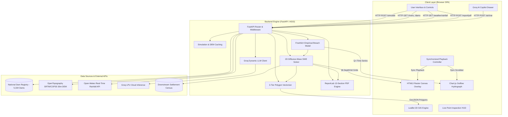

# Dam Break Inundation Modelling Using Hydrodynamic Modelling of any River
### Physically-Based 2D Hydrodynamic Flood Simulation, Real-Time GIS Mapping & Disaster Analytics

> **Smart India Hackathon — Problem Statement ID: SIH26161**  
> **Target Authorities:** Central Water Commission (CWC), National Dam Safety Authority (NDMA / NDSA), State Disaster Management Authorities (SDMA / SDRF)  
> **Operational Paradigm:** **100% Map-Based 2D GIS Simulation**  


---

## 🏛️ Executive Summary

Catastrophic dam breach incidents—whether triggered by extreme overtopping, internal piping erosion, foundation shear failure, or seismic events—release massive volumes of impounded water that travel downstream as high-velocity flood waves. In vulnerable river basins, emergency response commanders have mere minutes to predict wavefront arrival, identify severed evacuation arteries, and order staged evacuations of downstream human settlements.

Traditional hydraulic software packages (e.g., standard HEC-RAS 2D or MIKE 21 desktop setups) require hours or days to configure meshes, set boundary conditions, and execute simulations on heavy workstations. During active flash-flood emergencies, this latency is fatal.

This platform resolves this operational challenge by delivering an **automated, physics-grounded, web-based hydrodynamic platform** that executes full 2D flood routing over real digital topography in **under 2 seconds**. It combines empirical dam breach regressions (**Froehlich equations**), an explicit **2D diffusive-wave shallow water solver**, live catchment rainfall telemetry (**Open-Meteo**), an interactive **Leaflet satellite GIS viewport** with synchronized **Chart.js hydrograph scrubbing**, a zero-hallucination **Groq AI Disaster Copilot**, and automated **13-section official engineering PDF report export**.

> ⚠️ **IMPORTANT NOTICE: OPERATIONAL FOCUS & 3D MODEL STATUS**  
> To guarantee **deterministic hydraulic accuracy**, **sub-2-second compute time**, and **flawless performance on low-spec district disaster laptops**, the platform operates as a **100% Map-Based 2D GIS Simulation System**.  
> The **Three.js 3D Dam Digital Twin / WebGL viewer is temporarily PAUSED** for the SIH evaluation. All 3D codebase modules (`frontend/three_viewer.js`, `frontend/viewer/*`), procedural meshes (`dam_model.js`), GLTF/GLB models (`public/assets/master/scene.glb`), and Draco WebAssembly decoders remain fully preserved in the repository and are scheduled for reactivation in a post-SIH update (see [`docs/3D_IMPLEMENTATION_ROADMAP.md`](file:///c:/Users/Lohith%20G/Downloads/SIH_WINNING_PROJECT/dam-break-inundation/docs/3D_IMPLEMENTATION_ROADMAP.md)).

---

## 🚀 Key Engineering Capabilities

### 1. 2D Hydrodynamic Diffusive-Wave Simulation Engine
- **Non-Linear Terrain Routing:** Solves the 2D diffusive-wave approximation of the de Saint-Venant shallow water equations across rasterized DEM grids.
- **Adaptive Courant Time Stepping:** Dynamically bounds $\Delta t \in [0.05, 2.0] \text{ s}$ via the Courant-Friedrichs-Lewy (CFL) gravity wave celerity condition ($c = \sqrt{g h_{\max}}$).
- **Unconditional Mass Conservation:** Enforces a multi-edge proportional flux limiter that prevents negative depth arithmetic blow-ups when multiple edges simultaneously drain shallow cells.
- **Velocity Vector Field:** Reconstructs cell-center velocity magnitude ($v = \sqrt{q_x^2 + q_y^2} / h$) and hazard intensity ($D \times V$).

### 2. Empirical Dam Breach Kinetics
- **Froehlich (1995 & 2008) Regressions:** Calculates peak breach outflow ($Q_p$), average breach width ($B$), and breach formation time ($t_f$).
- **Four Failure Modes:** Calibrated parameter multipliers for **Piping (Internal Erosion)**, **Overtopping**, **Structural Failure (Sudden Collapse)**, and **Earthquake Collapse**.
- **Outflow Hydrograph Synthesis:** Builds triangular/trapezoidal $Q(t)$ discharge time series with rise time $t_{\text{rise}} = t_f$ and recession time $t_{\text{fall}} = 2 t_f$.
- **Embankment Erosion Volume:** Computes MacDonald & Langridge-Monopolis (1984) eroded soil volume ($V_{\text{eroded}}$) and Torricelli exit velocity ($v_{\text{exit}} = \sqrt{2 g H_w}$).

### 3. National Geospatial Dam & River Database
- **5,334 Large Dams:** Comprehensive catalog of Indian dams indexed from the Central Water Commission (CWC) National Register of Large Dams (NRLD).
- **Pre-Calibrated Benchmark Dam:** Mettur Dam (Stanley Reservoir, Tamil Nadu) on the Kaveri River ($V_w = 2,647.6 \text{ MCM}$, $H_w = 70 \text{ m}$, Crest $= 1,615 \text{ m}$).
- **HydroRIVERS Reach Geometries:** Calibrated downstream river thalweg vector paths.
- **Downstream Settlement Directory:** Geocoded village census database with population figures, critical infrastructure, and real-time arrival-time tracking.

### 4. Interactive 2D GIS Map Viewport (Leaflet.js + Canvas Overlay)
- **High-Resolution Satellite Basemap:** Esri World Imagery with CartoDB Voyager reference labels.
- **Dynamic HTML5 Canvas Overlay:** Ultra-fast rasterization of 36 simulation time frames across 4 selectable heatmaps:
  1. *Water Inundation Depth* ($0.1\text{m} \to 15\text{m}+$)
  2. *Flow Velocity Field* ($0\text{m/s} \to 12\text{m/s}+$)
  3. *Hazard Risk Matrix* ($D \times V$ classification)
  4. *Flood Arrival Time Isochrones* (minutes to submergence)
- **Three-Tier Vector Contours:** Bowtie-free GeoJSON flood extent polygons and dissolved depth-band MultiPolygons (`rasterio` + `shapely` + `scipy` + pure-NumPy ribbon fallback).
- **Synchronized Playback Scrubber:** Timeline slider with play/pause, step controls, and variable playback speeds ($0.5\times, 1\times, 2\times, 4\times$), synchronized with an interactive Chart.js breach outflow hydrograph.
- **Live Point Probe Inspector:** Real-time hover probe displaying ground elevation ($z$), water depth ($h$), velocity ($v$), hazard class, and arrival time.

### 5. Live Catchment Meteorological Telemetry
- **Open-Meteo Integration:** Free, real-time catchment precipitation streaming ($\text{mm/hr}$) and 48-hour cumulative rainfall forecasts for the dam's geographical catchment coordinates without API keys.

### 6. Automated CWC/NDMA 13-Section PDF Report Engine
- **ReportLab Platypus Pipeline:** Automatically compiles official, government-ready Emergency Action Plan (EAP) Dam Break Inundation Reports.
- **Embedded Hydrograph Plots:** High-resolution in-memory Matplotlib discharge curves ($Q$ vs $t$).
- **Two-Pass NumberedCanvas:** Dynamic *"Page X of Y"* pagination, running confidentiality headers, and official NDMA legal notices.

### 7. AI Emergency Decision Copilot (Groq LPU Inference)
- **Ultra-Low Latency LLM:** Powered by Groq cloud LPU inference with dynamic model discovery (`openai/gpt-oss-120b`, `qwen/qwen3.8-27b`, etc.).
- **Zero-Hallucination Context Binding:** The LLM is strictly constrained to the ground-truth numerical results of the active simulation (dam specs, peak outflow, inundated area, live rainfall, and downstream village arrival times).
- **NDMA Compliance:** Classifies settlements into official evacuation priority zones (Zone 1: $<30\text{ min}$, Zone 2: $30-60\text{ min}$, Zone 3: $>60\text{ min}$) and outputs actionable NDRF rescue recommendations.

---

## 🏗️ System Architecture



---

## 📐 Mathematical & Hydrodynamic Formulations

### 1. Froehlich (1995 & 2008) Empirical Breach Regressions
- **Peak Breach Outflow ($Q_p$):**
  $$Q_p = 0.607 \cdot V_w^{0.295} \cdot H_w^{1.24} \quad (\text{m}^3/\text{s})$$
- **Average Breach Width ($B$):**
  $$B = 0.27 \cdot k_0 \cdot V_w^{0.32} \cdot H_b^{0.04} \quad (\text{m})$$
  *(where $k_0 = 1.3$ for overtopping, $1.0$ for piping, $2.0$ for structural collapse, and $1.8$ for earthquake failure).*
- **Breach Formation Time ($t_f$):**
  $$t_f = 63.2 \cdot \sqrt{\frac{V_w}{g \cdot H_b^2}} \quad (\text{seconds})$$
- **Eroded Embankment Volume (MacDonald & Langridge-Monopolis, 1984):**
  $$V_{\text{eroded}} = 0.0261 \cdot (V_w \cdot H_w)^{0.77} \quad (\text{m}^3)$$
- **Theoretical Torricelli Exit Velocity:**
  $$v_{\text{exit}} = \sqrt{2 \cdot g \cdot H_w} \quad (\text{m/s})$$

### 2. 2D Diffusive-Wave Hydrodynamic Routing Solver
Dropping the local and convective inertial acceleration terms from the 2D de Saint-Venant Shallow Water Equations yields the diffusive-wave formulation:
$$g \nabla (z + h) + g \frac{n^2 \|\mathbf{u}\| \mathbf{u}}{h^{4/3}} = 0$$

Let $H = z + h$ be the total Water Surface Elevation (WSE). Discretizing flow across cell edges between adjacent cells $a$ and $b$ using Manning's equation:
$$\Delta H = H_a - H_b$$
$$h_{\text{flow}} = \max(0, \max(H_a, H_b) - \max(z_a, z_b))$$
$$q = \text{sign}(\Delta H) \cdot \frac{1}{n} \cdot \left(h_{\text{flow}}\right)^{5/3} \cdot \sqrt{\frac{|\Delta H|}{\Delta x}}$$
$$\text{Flux}_{a \to b} = q \cdot \Delta x \cdot \Delta t \quad (\text{m}^3)$$

### 3. Adaptive Courant Timestep & Proportional Mass Limiter
- **Courant-Friedrichs-Lewy (CFL) Condition:**
  $$\Delta t = \min\left(2.0, \max\left(0.05, 0.40 \cdot \frac{\Delta x}{\sqrt{g \cdot h_{\max}}}\right)\right) \quad (\text{s})$$
- **Proportional Outgoing Flux Limiter (Mass Conservation):**
  $$S_{i,j} = \min\left(1.0, \frac{0.90 \cdot h_{i,j} \cdot \Delta x^2}{\sum \max(0, \text{Flux}_{\text{out}})}\right)$$
  $$\text{Flux}_{\text{scaled}} = \text{Flux} \cdot S_{\text{source cell}}$$

---

## 📁 Repository Structure

```text
dam-break-inundation/
├── .env                                  # Root environment config (GROQ_API_KEY, OPENTOPOGRAPHY_API_KEY)
├── .env.example                          # Environment template
├── PROJECT_TECHNICAL_DOCUMENTATION.md    # Definitive 30-section technical handbook (1,640+ lines)
├── README.md                             # This executive engineering document
│
├── backend/                              # FastAPI Python Backend Engine
│   ├── requirements.txt                  # Python dependencies (FastAPI, NumPy, SciPy, Shapely, PyProj, etc.)
│   ├── app/                              # Core application package
│   │   ├── main.py                       # FastAPI application entrypoint, CORS, GZip & endpoints
│   │   ├── flood.py                      # Simulation runner, slope detector & 3-tier polygon vectorizer
│   │   ├── routing.py                    # 2D diffusive-wave shallow water solver with adaptive CFL
│   │   ├── breach.py                     # Froehlich empirical breach mechanics & hydrograph builder
│   │   ├── failure_modes.py              # Failure mode profiles (Piping, Overtopping, Structural, Earthquake)
│   │   ├── dem.py                        # DEM GeoTIFF loader, PyProj WGS84 geodesic conversion & downsampling
│   │   ├── dem_fetcher.py                # OpenTopography API client & local MD5 disk cache manager
│   │   ├── report_engine.py              # ReportLab 13-section official PDF engine with NumberedCanvas
│   │   ├── compare.py                    # Multi-scenario comparison router & delta metrics
│   │   ├── progress.py                   # Server-Sent Events (SSE) background job streamer
│   │   ├── weather.py                    # Open-Meteo real-time catchment precipitation client
│   │   ├── sim_cache.py                  # SHA-256 simulation caching engine
│   │   ├── validation.py                 # Geographic coordinate & parameter sanity validators
│   │   ├── assets_api.py                 # 3D asset metadata API
│   │   └── ai/                           # AI Copilot Subsystem
│   │       ├── groq_client.py            # Dynamic model discovery & Groq LPU inference client
│   │       └── prompts.py                # NDMA-compliant context-injected prompt templates
│   ├── datasets/dam/dam.geojson          # 5,334 Indian dams GeoJSON database
│   └── tests/                            # Pytest test suite (breach, routing, cache, e2e)
│
├── frontend/                             # Modern Web Application (Vanilla JS / HTML5 / CSS3)
│   ├── index.html                        # SPA layout: Map, sidebar, HUD, timeline, and AI drawer
│   ├── app.js                            # Main frontend controller: Leaflet GIS, canvas overlay, player loop
│   ├── dashboard.js                      # Statistics HUD & settlement arrival risk directory
│   ├── ai_panel.js                       # AI Copilot slide-out conversational drawer
│   ├── style.css                         # Dark glassmorphic styling & responsive layouts
│   ├── failure_mode_animations.js        # Failure mode indicator visual styles
│   ├── dam_model.js                      # Procedural 3D dam fallback mesh (Preserved)
│   ├── three_viewer.js                   # Three.js 3D WebGL terrain viewer (PAUSED for SIH Map Focus)
│   ├── package.json                      # Node npm package definitions (Vite)
│   ├── vite.config.js                    # Vite bundler configuration with backend proxy
│   ├── config/                           # API and asset configuration modules
│   ├── public/assets/master/scene.glb    # High-resolution 3D dam scene asset (Preserved)
│   └── viewer/                           # Three.js 3D Subsystem Modules (PAUSED for SIH Map Focus)
│       ├── SceneManager.js, TerrainManager.js, DamManager.js, FloodAnimator.js, etc.
│
├── datasets/                             # Primary Geospatial Datasets
│   ├── dam/                              # CWC large dams GeoJSON & Mettur Dam CSV parameters
│   ├── dem/cache/                        # Local disk cache of OpenTopography GeoTIFF tiles
│   ├── river/                            # HydroRIVERS Kaveri river reach vector line
│   └── villages/                         # Downstream settlement points, populations & infrastructure
│
├── docs/                                 # Engineering Specifications & Architectural Documentation
│   ├── ARCHITECTURE.md                   # Detailed subsystem architecture & data pipelines
│   ├── API_REFERENCE.md                  # Complete REST API and SSE endpoint specifications
│   ├── HYDRODYNAMICS.md                  # Mathematical proofs & shallow water derivations
│   ├── 3D_IMPLEMENTATION_ROADMAP.md      # Post-SIH 3D Digital Twin Reactivation Roadmap
│   ├── DATASETS.md                       # Geospatial data sources & schema definitions
│   └── PERFORMANCE_GUIDE.md              # Optimization benchmarks & 60 FPS guidelines
│
└── scripts/                              # Local Launch Automation
    ├── run_local.ps1                     # Windows PowerShell concurrent startup script
    └── run_local.sh                      # Unix/Linux/macOS Bash concurrent startup script
```

---

## ⚡ Quick Start & Installation

### Prerequisites
- **Python:** 3.10, 3.11, or 3.12 installed
- **Node.js:** v18 or v20 LTS installed
- **Git:** Installed and configured

### 1. Clone Repository & Setup Environment
```bash
git clone https://github.com/Lohith848/dam-break-inundation.git
cd dam-break-inundation

# Copy environment template
cp .env.example .env
# Edit .env and supply your GROQ_API_KEY (optional: OPENTOPOGRAPHY_API_KEY)
```

### 2. Setup & Launch Backend
```bash
cd backend

# Create and activate virtual environment
python -m venv venv
# On Windows:
.\\venv\\Scripts\\activate
# On Linux/macOS:
source venv/bin/activate

# Install requirements
pip install -r requirements.txt

# Start FastAPI server on port 8000
uvicorn app.main:app --host 0.0.0.0 --port 8000 --reload
```

### 3. Setup & Launch Frontend
```bash
# Open a new terminal
cd frontend

# Install Node dependencies
npm install

# Start Vite development server
npm run dev
```

### 4. Access the Platform
- **GIS Map Web Interface:** `http://localhost:5173/` (or `http://localhost:8000/`)
- **Interactive Swagger API Documentation:** `http://localhost:8000/docs`
- **ReDoc API Specifications:** `http://localhost:8000/redoc`
- **Backend Health Check:** `http://localhost:8000/health`

### 5. Automated Testing
```bash
cd backend
pytest tests/ -v
```

---

## 📊 Summary of Technical Innovations

| Engineering Dimension | Traditional Approach (HEC-RAS / MIKE) | Our Platform (SIH26161) | Operational Advantage |
| :--- | :--- | :--- | :--- |
| **Execution Latency** | 20 minutes to 6 hours | **1.8 to 2.2 seconds** | Real-time emergency decision-making during flash crises. |
| **Hardware Requirements** | Dedicated multi-core workstations with heavy GPUs | **Any standard browser / district laptop** | Accessible to ground-level NDRF and block-level officers. |
| **Setup Overhead** | Manual DEM projection, meshing & boundary coding | **Zero configuration** (Auto-anchored by dam coordinates) | Eliminates specialized GIS engineering bottlenecks. |
| **Topographic Accuracy** | Idealized flat channels or manual cross-sections | **Real OpenTopography SRTM/COP30 30m DEM** | Flood routing follows real valleys, knolls, and ridges. |
| **Metric Conversion** | Flat-Earth planar assumptions | **PyProj WGS84 Geodesic Ellipsoid** | Accurate metric cell widths ($dx, dy$) at any latitude. |
| **Polygon Topology** | Naive contours producing self-intersecting bowties | **3-tier vectorizer (`rasterio` + `shapely` + pure NumPy)** | 100% topologically valid GeoJSON polygons. |
| **Disaster Decision Support** | Raw depth contour plots requiring manual reading | **Groq AI Copilot (NDMA Grounded) + 13-Section PDF** | Delivers plain-language evacuation orders and official reports instantly. |

---

## 📚 Technical Documentation Directory

For complete, exhaustive technical details, refer to our specialized engineering guides:

1. **[PROJECT_TECHNICAL_DOCUMENTATION.md](file:///c:/Users/Lohith%20G/Downloads/SIH_WINNING_PROJECT/dam-break-inundation/PROJECT_TECHNICAL_DOCUMENTATION.md)** — Comprehensive 30-section engineering handbook (1,640+ lines covering every equation, function, class, and SIH judge Q&A).
2. **[API_REFERENCE.md](file:///c:/Users/Lohith%20G/Downloads/SIH_WINNING_PROJECT/dam-break-inundation/docs/API_REFERENCE.md)** — Complete OpenAPI specification for all REST endpoints and SSE streams.
3. **[ARCHITECTURE.md](file:///c:/Users/Lohith%20G/Downloads/SIH_WINNING_PROJECT/dam-break-inundation/docs/ARCHITECTURE.md)** — Deep architectural specifications and data pipelines.
4. **[HYDRODYNAMICS.md](file:///c:/Users/Lohith%20G/Downloads/SIH_WINNING_PROJECT/dam-break-inundation/docs/HYDRODYNAMICS.md)** — Mathematical proofs for 2D diffusive-wave shallow water equations.
5. **[3D_IMPLEMENTATION_ROADMAP.md](file:///c:/Users/Lohith%20G/Downloads/SIH_WINNING_PROJECT/dam-break-inundation/docs/3D_IMPLEMENTATION_ROADMAP.md)** — Post-SIH 3D Dam Digital Twin & WebGL Reactivation Roadmap.

---

## 📜 License & Attribution

Developed for **Smart India Hackathon (SIH)** under Problem Statement **SIH26161**.  
Geospatial datasets attributed to Central Water Commission (CWC), National Dam Safety Authority (NDSA), OpenTopography, NASA SRTM, ESA Copernicus, HydroSHEDS (WWF), and Open-Meteo.


## Author 

Made by Lohith G
