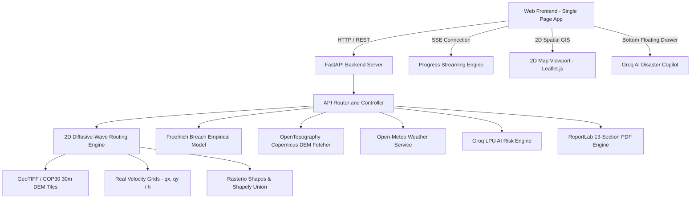

# System Architecture & Technical Specifications — SIH26161 (Map-First Release)

## Overview

The **SIH26161 Dam Break Inundation Modeling Platform** is an integrated, high-performance geospatial hydrodynamic simulation suite for SIH 2026. It couples empirical dam breach equations (Froehlich 1995/2008) with a 2D diffusive-wave flood routing solver, real-time velocity grids, smooth topological polygon extraction, CWC/NDMA executive PDF report generation, and an enterprise Groq AI disaster copilot.

> **Architecture Scope Note**: In the current production release, the platform operates in a **Map-First 2D GIS Architecture** using Leaflet GIS, raster contour extraction, and vector overlays. This ensures maximum stability, deterministic hydraulic accuracy, and instantaneous response across all devices. The **3D Dam Digital Twin** subsystem is actively documented and scheduled for an upcoming update (see [`docs/3D_IMPLEMENTATION_ROADMAP.md`](file:///c:/Users/Lohith%20G/Downloads/SIH_WINNING_PROJECT/dam-break-inundation/docs/3D_IMPLEMENTATION_ROADMAP.md)).

---

## High-Level System Architecture

---

## Subsystem Architecture

### 1. Computational Backend Service (`backend/app/`)

| Module | Responsibility |
|---|---|
| `main.py` | FastAPI app, CORS, routes, static asset serving, `/simulate`, `/simulate/start`, `/report/pdf`, `/ai/chat` |
| `flood.py` | Simulation orchestration, 2D hydrodynamic solver execution, smooth polygon contour generation, and result packaging |
| `routing.py` | 2D diffusive-wave Saint-Venant solver; CFL-adaptive time-stepping; mass conservation limiter; unit discharge to velocity |
| `breach.py` | Froehlich (1995/2008) & MacDonald empirical breach regressions; peak discharge $Q_p$, breach width $B$, and formation time $t_f$ |
| `failure_modes.py` | Failure mode physics and kinetics (Piping, Overtopping, Structural Collapse, Earthquake) |
| `report_engine.py` | Official 13-section CWC/NDMA government PDF generator with vector hydrograph charts |
| `progress.py` | SSE job queue; broadcasts live percentage progress and stage status during computation |
| `dem_fetcher.py` | OpenTopography Copernicus 30m / SRTM fetcher with local disk caching |
| `weather.py` | Live precipitation intensity ($\text{mm/hr}$) from Open-Meteo |
| `compare.py` | Multi-scenario side-by-side comparative breach analysis |
| `ai/` | Groq client with fast inference, civil engineering system prompts, and structured Q&A |

### 2. Frontend Web Client (`frontend/`)

| File | Responsibility |
|---|---|
| `index.html` | Semantic single-page layout: control sidebar, map viewport, layer toggles, timeline player, bottom copilot launcher |
| `app.js` | Application state coordination, Leaflet GIS player, timeline animation ($0.5\times$ to $5\times$), smooth polygon wavefront overlay |
| `ai_panel.js` | Floating bottom-corner Groq AI Copilot; non-blocking drawer; table & list rendering; pre- and post-simulation Q&A |
| `style.css` | Enterprise GIS dark theme; glassmorphism cards; bottom copilot panel; responsive controls |
| `config/api.js` | Centralized API base URL resolver (auto-detects port 8000 vs 5173) |
| `vite.config.js` | Vite dev server and production bundler configuration |

---

## Hydrodynamic Data Pipeline

1. **Input**: Dam selection -> Failure mode -> Reservoir volume -> Dam height -> Manning's $n$ -> Duration.
2. **Breach Calc**: Empirical formulations calculate peak discharge $Q_p$, breach width $B$, and formation time $t_f$.
3. **DEM Acquisition**: Copernicus 30m DEM fetched via OpenTopography or generated from regional terrain elevation models.
4. **Hydrodynamic Routing**: 2D diffusive-wave equations solved with adaptive $\Delta t$ ($\text{CFL} \le 0.5$); returns `depth_grids` and `velocity_grids`.
5. **Smooth Vector Polygons**: Contours extracted via `rasterio.features.shapes`, cleaned with `shapely.ops.unary_union`, smoothed, and simplified for 60 FPS rendering.
6. **GIS Multi-Layer Rendering**: Interactive Leaflet layers for Depth, Flow Velocity, Hazard Risk ($D \times V$), and Arrival Time contours.
7. **Decision-Support Reporting**: On-demand 13-section CWC/NDMA PDF report generation with high-resolution hydrograph plots.

---

## Future 3D Digital Twin Architecture (Post-SIH Roadmap)

The platform is designed to seamlessly integrate a WebGL 3D Digital Twin after the initial deployment:
- **WebGL Viewport**: Three.js r160+ rendering procedural 3D terrain meshes from DEM elevation grids.
- **Dynamic Water Shader**: GLSL vertex displacement driven directly by backend `depth_grids`.
- **Structural Dam Models**: Draco-compressed GLB dam assets (`public/assets/master/scene.glb`).
- **Full Roadmap**: Detailed specifications, LOD strategies, and camera controls are documented in [`docs/3D_IMPLEMENTATION_ROADMAP.md`](file:///c:/Users/Lohith%20G/Downloads/SIH_WINNING_PROJECT/dam-break-inundation/docs/3D_IMPLEMENTATION_ROADMAP.md).
