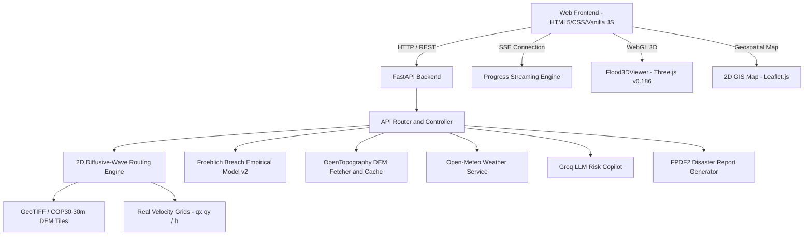

# System Architecture & Technical Specifications — SIH26161 (v2 Release)

## Overview

The **SIH26161 Dam Break Inundation Modeling Platform** is an integrated, high-performance geospatial hydrodynamic simulation suite for SIH 2026. It couples empirical dam breach equations (Froehlich 1995/2008) with a 2D diffusive-wave flood routing solver, real-time velocity grids, and a full-featured WebGL/GIS visualization stack.

---

## High-Level System Architecture



---

## Subsystem Architecture

### 1. Backend Service (backend/app/)

| Module | Responsibility |
|---|---|
| main.py | FastAPI app, CORS, routes, static mount, /simulate + /simulate/stream returning velocity_grids |
| routing.py | 2D diffusive-wave solver; CFL-adaptive time-stepping; unit-discharge to velocity computation (return_velocities=True) |
| flood.py | Simulation orchestration; downsampled velocity_grids snapshots; SimulationResult dataclass |
| breach.py | Froehlich v2 — froehlich_breach_width_v2, breach_formation_time_v2, peak discharge for all 4 failure modes |
| progress.py | SSE job queue; broadcasts velocity_grids in result payload |
| dem_fetcher.py | OpenTopography COP30/SRTM fetch with disk cache |
| weather.py | Live rainfall (mm/hr) from Open-Meteo |
| compare.py | Side-by-side multi-scenario comparison |

### 2. Frontend Web Client (frontend/)

| File | Responsibility |
|---|---|
| index.html | Single-page layout: sidebar controls, stage with 3D viewport + 2D map, 9-camera toolbar, render mode switcher, heatmap legend, dashboard dock |
| three_viewer.js (v5) | Flood3DViewer — terrain mesh, PBR water, Draco GLB dam model, 9 camera modes, 4 failure-mode VFX, depth/velocity heatmaps, village beacons, CSS2D labels, bloom/SSAO post-processing |
| dashboard.js | SimulationDashboard — 8 real engineering metrics with provenance badges (live, derived, pending); frame-by-frame updates via bind(viewer) |
| app.js | Application controller — search, simulation run, showResults(), setup3DToolbar(), updateHeatmapLegend(), terrain probe with velocity |
| ai_panel.js | Groq AI Copilot drawer, chat, PDF export |
| style.css | Dark glassmorphism design system; toolbar, heatmap legend, dashboard dock, metric grid, responsive breakpoints |
| config/assets.js | Asset manifest — DAM_MODEL.filename, damModelURL() |
| config/api.js | Centralised API base URL |

### 3. Asset Structure (public/assets/)

```
public/assets/
├── models/
│   ├── dam/           dam_structure.glb  (Draco-compressed)
│   ├── terrain/       [elevation meshes]
│   ├── buildings/     [settlement footprints]
│   ├── vegetation/    [instanced trees]
│   ├── bridges/       [bridge geometry]
│   └── debris/        [debris models]
├── textures/
│   ├── dam/           [PBR material maps]
│   ├── terrain/       [satellite/rock/grass]
│   ├── water/         [normal, foam, caustic]
│   └── environment/   [sky, cloud, decal]
├── hdri/              [environment lighting]
├── icons/             [status, UI icons]
├── fonts/             [Inter, JetBrains Mono]
├── audio/             [optional ambience]
└── shaders/           [custom GLSL]
```

---

## Hydrodynamic Data Pipeline

1. **Input**: Dam selection -> failure mode -> reservoir volume -> Manning's n -> grid resolution
2. **Breach Calc**: Froehlich v2 -> peak outflow Qp, breach width B, formation time tf
3. **DEM Fetch**: OpenTopography COP30 raster -> NumPy grid
4. **Routing**: 2D diffusive-wave; adaptive CFL <= 0.5; snapshots every N steps -> depth_grids + velocity_grids (m/s, real physical values, V = q/h)
5. **Impact**: Max depth, inundated area km2, settlement arrival times, status triage
6. **Visualization**: JSON payload -> 3D terrain + water mesh + depth/velocity heatmaps + 2D flood contour overlay

---

## Three.js 3D Viewer — Key Technical Specifications

| Feature | Implementation |
|---|---|
| Terrain | PlaneGeometry (nx x ny), vertex Y from DEM x exaggeration factor + realistic multi-band mountain textures |
| Water Mesh | Shared PlaneGeometry with per-vertex colors driven by depth/velocity ramp |
| Dam Model | Draco-compressed GLB via DRACOLoader + procedural weathered concrete fallback |
| Depth Heatmap | 6-stop: Blue -> Cyan -> Green -> Yellow -> Orange -> Dark Red (0-8+ m) |
| Velocity Heatmap | 5-stop: Blue -> Green -> Yellow -> Orange -> Red (0-5+ m/s) |
| Camera Modes | Operational Views: Dam, Valley, Top (smooth tween transitions with focus on breach) |
| Failure VFX | Overtopping sheet + progressive notch; Piping dust burst; Structural crack decal + debris; Earthquake shake + rapid collapse |
| Post-processing | ACESFilmic tone mapping (0.70 exposure), restrained bloom (0.04), SSAOPass, OutputPass; calibrated for engineering clarity |
| Settlement Beacons | CSS2DRenderer labels (Inter) + sphere markers colour-coded by depth status |

